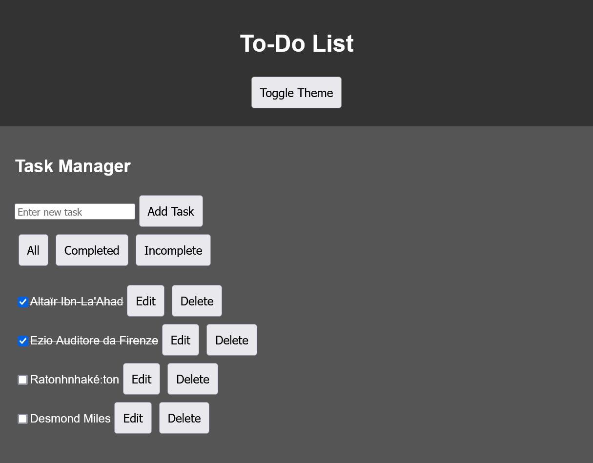
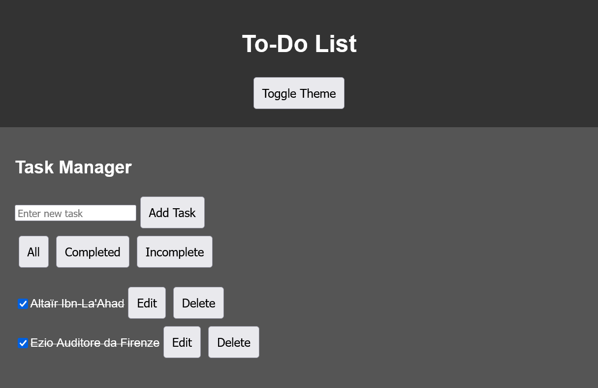
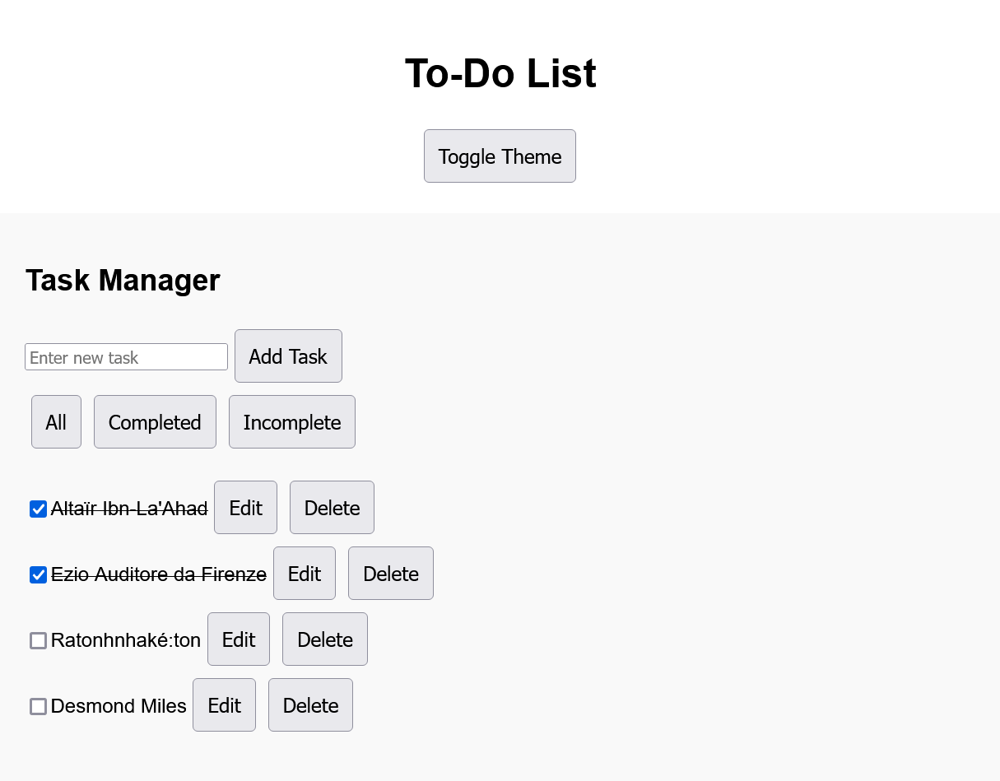
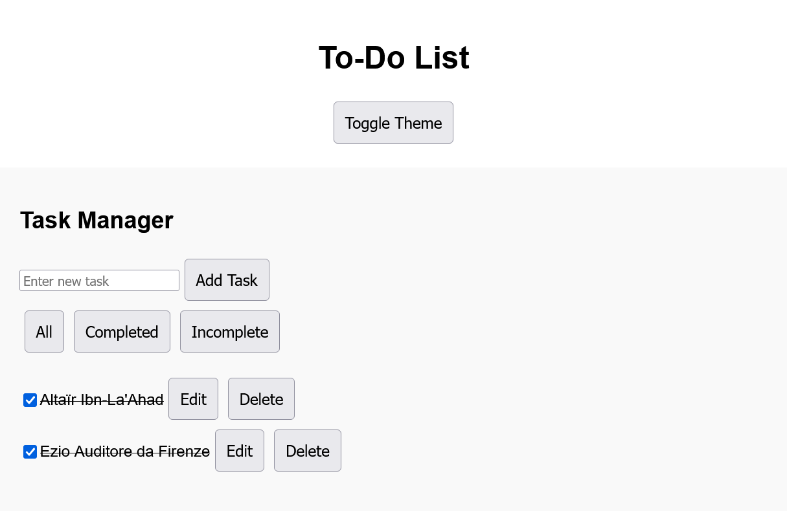

# Task Manager Application

A simple React task manager application that allows you to add, edit, delete, and filter tasks. It utilizes `useState`, `useEffect`, `useContext`, `useReducer`, `useMemo`, and `useCallback` to manage state and optimize performance.

## Features

- Add tasks
- Edit tasks
- Delete tasks
- Toggle task completion
- Filter tasks (all, completed, incomplete)
- Persist tasks in local storage
- Global state management using `useContext`
- Optimized task actions using `useReducer`
- Memoized filtered tasks using `useMemo`
- Memoized callback functions using `useCallback`

## Getting Started

These instructions will get you a copy of the project up and running on your local machine for development and testing purposes.

### Prerequisites

- Node.js
- npm (Node Package Manager)

### Installation

1. Clone the repository
    ```sh
    git clone https://github.com/n-marcelino/react-hooks
    ```
2. Navigate to the project directory
    ```sh
    cd react-hooks
    ```
3. Install the dependencies
    ```sh
    npm install
    ```

### Running the Application

To start the development server, run:
```sh
npm start
```
This will start the application on http://localhost:3000.

## Project Structure
```
src/
│
├── components/
│   ├── Button.js
│   ├── Content.js
│   ├── Header.js
│   ├── TaskManager.js
│
├── context/
│   ├── TaskContext.js
│   ├── ThemeContext.js
│
├── App.js
├── index.js
├── styles.css
│
└── README.md
```

### File Descriptions

#### `components/`

- **Button.js**: Reusable component for buttons used within the application.
- **Content.js**: Placeholder component or container for main content.
- **Header.js**: Component responsible for rendering the application header.
- **TaskManager.js**: Main component managing tasks, including CRUD operations and filtering.

#### `context/`

- **TaskContext.js**: Context for managing global state related to tasks using `useReducer`.
- **ThemeContext.js**: Placeholder context for managing application theme (if applicable).

#### `App.js`

Main entry point of the application, wrapping components and providing context providers.

#### `index.js`

Entry point for rendering the React application into the DOM.

#### `styles.css`

Global stylesheet for basic styling of the application components.

#### `README.md`

Documentation file providing information about the project, including setup instructions, features, and project structure.

## Screenshots

### Dark Mode


*Task Manager displaying all tasks in dark mode.*


*Task Manager showing completed tasks in dark mode.*


*Task Manager displaying incomplete tasks in dark mode.*

### Light Mode


*Task Manager displaying all tasks in light mode.*


*Task Manager showing completed tasks in light mode.*


*Task Manager displaying incomplete tasks in light mode.*
